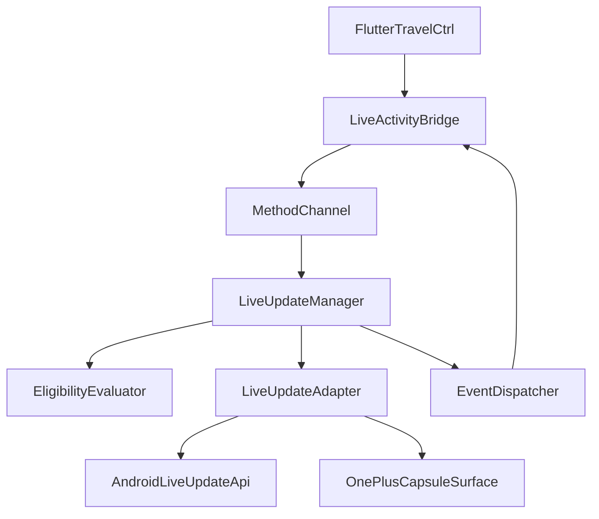
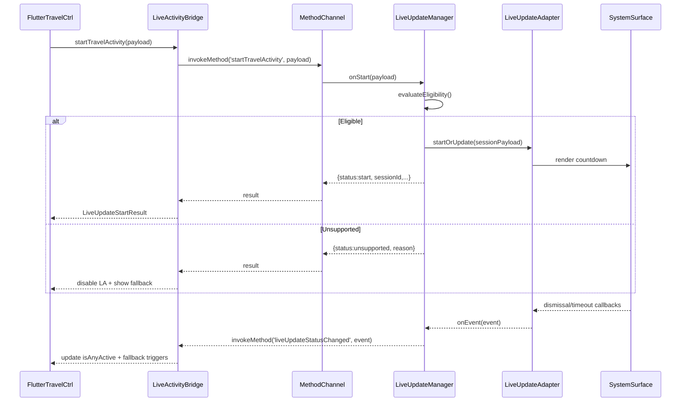

# Design Document

## Overview
This feature delivers Android-native Live Updates for Torn PDA travel countdowns so travelers can monitor departure and arrival timers from lock screen, notification shade, or OEM “island” capsules (OnePlus 13 priority) without opening the app. Flutter keeps orchestrating countdown data, while the Android layer exposes a small Kotlin bridge that speaks the new Live Updates API and reports lifecycle events back to Dart.

Players who rely on travel timers, chain coordination, or repatriation alerts benefit from glanceable surfaces that stay synchronized with the existing iOS Live Activity flow. The design reuses the `LiveActivityTravelController` for timer logic, adds eligibility detection so unsupported devices fall back immediately, and ensures taps always deep-link into `MainActivity`.

### Goals
- Deliver real-time travel countdowns via Android Live Updates with ±1s accuracy relative to Flutter timers.
- Provide structured eligibility responses (OS, OEM capsule, permissions) and expose them to Flutter for UI messaging.
- Keep lifecycle parity with iOS (start/update/end/dismiss callbacks) so analytics and fallbacks remain consistent.

### Non-Goals
- No push-to-start token registration on Android (APNs-only concept today).
- No redesign of existing widgets or notifications; they remain separate fallbacks.
- No server-side Live Update orchestration; all logic stays client-side until official APIs mature.

## Architecture

### Existing Architecture Analysis
- Flutter currently owns all travel state inside `LiveActivityTravelController`, which already gates activation by platform and emits payloads through `LiveActivityBridgeController`.
- `LiveActivityBridgeController` speaks to `com.tornpda.liveactivity`; only iOS implements the channel today, so Android returns PlatformExceptions.
- Android’s `MainActivity` already hosts another MethodChannel (`tornpda.channel`), showing the accepted pattern for returning maps and interacting with Flutter.
- Notifications, widgets, and WorkManager lives inside `lib/utils/`, so the new bridge must not bypass those helpers. Instead it should inform Flutter when a Live Update fails so existing surfaces can take over.

### Architecture Pattern & Boundary Map
Selected pattern: Adapter-backed bridge. `LiveUpdateManager` owns lifecycle orchestration and delegates to pluggable adapters (`AndroidLiveUpdateAdapter`, `NoOpLiveUpdateAdapter`). Eligibility, capability caching, and event dispatch live alongside the manager so `MainActivity` stays lean. Boundaries follow existing steering guidance: Flutter for state, Kotlin utilities for native services, and OEM/OS APIs hidden behind adapters.

**Architecture Integration**
- Domain boundaries: travel state stays in Flutter; Android only renders surfaces and reports capability snapshots.
- Existing patterns preserved: MethodChannel for bridge, `utils/` for shared services, `MainActivity` as entry point.
- New components rationale: `LiveUpdateManager` centralizes lifecycle, `EligibilityEvaluator` prevents unsupported sessions, `EventDispatcher` feeds back dismissal/timeout events, and `CapabilityStore` shares OnePlus capsule status.
- Steering compliance: honors separation of UI (Flutter) vs utilities (native), keeps contracts typed, and enables team-safe adapter swapping.

### Technology Stack

| Layer | Choice / Version | Role in Feature | Notes |
|-------|------------------|-----------------|-------|
| Flutter | Flutter 3.3 / Dart 3 | Owns travel timers, bridge DTOs, and UI messaging | Reuses existing controllers with minor extensions |
| Android Native | Kotlin 1.9 (new module in `android/app/src/main/java`) | Implements MethodChannel handler, eligibility evaluator, LiveUpdateManager | Kotlin-only additions; existing Java MainActivity will host handler until Kotlin migration completes |
| Android Live Updates API | Android 15+ Live Update SDK (pending) | Renders countdown surfaces on lock screen/shade/capsules | Wrapped via `AndroidLiveUpdateAdapter`; `NoOp` used on lower APIs |
| OEM Capsule Integration | OnePlus Capsule intents/settings | Ensures tap + animation parity on OnePlus 13 | Accessed via `OemCapabilityDetector` and capsule-specific metadata |
| Data / Storage | SharedPreferences (Prefs wrapper) | Persists capability snapshot + last session metadata for Flutter | Lives in Kotlin utility to align with existing Prefs usage |
| Messaging / Events | MethodChannel callbacks + existing notification helpers | Propagate dismissal/timeouts + trigger fallbacks | No additional remote services |

## System Flows

Key decisions: eligibility always runs before adapter invocation; dismissal/time-out automatically notify Flutter; fallback notifications triggered when `status=timeout`.

## Requirements Traceability

| Requirement | Summary | Components | Interfaces | Flows |
|-------------|---------|------------|------------|-------|
| Capability Scoping & Device Eligibility | Detect support, expose capsule flag, return unsupported reasons | LiveUpdateManager, EligibilityEvaluator, CapabilityStore, LiveActivityBridge | MethodChannel `startTravelActivity` result + `getLiveUpdateCapabilities` | Start sequence pre-check |
| Countdown Content & Refresh Accuracy | Render accurate timers, propagate ETA changes, arrival state | LiveActivityTravelController, LiveUpdateManager, AndroidLiveUpdateAdapter | MethodChannel payload schema, Adapter-to-API contract | Start/update path in sequence diagram |
| Interaction & Surface Behavior | Tap -> MainActivity, parity across surfaces, dismissal callback | AndroidLiveUpdateAdapter, OemCapsuleAdapter, EventDispatcher | PendingIntent contract, `liveUpdateStatusChanged` callback | Sequence + OEM-specific flows |
| Lifecycle Management & Fallback Handling | Session IDs, end requests, timeout fallback, `isAnyActive` sync | LiveUpdateManager, SessionRegistry, LiveActivityBridge | `start`, `end`, `isAnyTravelActivityActive`, dismissal events | Sequence + telemetry path |

## Components and Interfaces

### Component Summary

| Component | Domain/Layer | Intent | Req Coverage | Key Dependencies (Criticality) | Contracts |
|-----------|--------------|--------|--------------|-------------------------------|-----------|
| LiveActivityTravelController | Flutter | Gather travel data and decide when to start/update/end sessions | Countdown Content & Refresh Accuracy; Lifecycle Management | ChainStatusController (P0), LiveActivityBridge (P0) | `startActivity(payload)`, `endActivity()` |
| LiveActivityBridgeController | Flutter | Serialize payloads, await MethodChannel results, dispatch status events | All requirements | MethodChannel `com.tornpda.liveactivity` (P0) | `startTravelActivity`, `endTravelActivity`, `isAnyTravelActivityActive`, new callbacks |
| LiveUpdateMethodChannelHandler | Android Native | Handle incoming channel calls and route them to manager | All requirements | FlutterEngine messenger (P0), LiveUpdateManager (P0) | Method handlers for start/end/status/token/capabilities |
| LiveUpdateManager | Android Native | Orchestrate eligibility, adapter delegation, session registry, and event dispatch | All requirements | EligibilityEvaluator (P0), LiveUpdateAdapter (P0), EventDispatcher (P1) | `startOrUpdate(payload)`, `end(sessionId)`, `isAnyActive()` |
| EligibilityEvaluator & CapabilityStore | Android Native | Evaluate OS/OEM/permission readiness and expose capability flags | Capability Scoping & Device Eligibility | PackageManager (P1), NotificationManager (P1), SharedPreferences (P2) | `evaluate(request)`, `currentSnapshot()` |
| LiveUpdateAdapter (Android + OEM) | Android Native | Translate session payload into Live Updates API + OEM capsule metadata | Countdown Content & Refresh Accuracy; Interaction & Surface Behavior | Android Live Updates SDK (P0), PendingIntentFactory (P1), OemCapsuleAdapter (P1) | `startOrUpdate(LiveUpdatePayload)`, `end(sessionId)` |
| EventDispatcher & SessionRegistry | Android Native | Persist active session metadata, emit callbacks to Flutter, keep `isAnyActive` accurate | Lifecycle Management & Fallback Handling | SharedPreferences/Room optional (P2), MethodChannel (P0) | `emitStatus(event)`, `activeSession()` |

### Flutter Layer

#### LiveActivityTravelController
| Field | Detail |
|-------|--------|
| Intent | Maintain travel lifecycle and request Live Updates when player travels |
| Requirements | Countdown Content & Refresh Accuracy, Lifecycle Management & Fallback Handling |
| Owner / Reviewers | Flutter Core Team |

**Responsibilities & Constraints**
- Continue to derive travel IDs and payload args; add logic to parse `LiveUpdateStartResult` so unsupported statuses trigger fallback notifications immediately.
- Maintain ±1s accuracy by feeding server timestamps and delta adjustments already present for iOS.
- Cache last `sessionId` for telemetry linking to Kotlin events; pass to `endActivity` when finishing travel or going idle.

**Interfaces**
- Input: `StatusObservable` from `ChainStatusController` (unchanged).
- Output: `LiveActivityBridge.startActivity(Map<String, dynamic>)` now returning `LiveUpdateStartResult`.
- Error interpretation: When `result.status == "unsupported"`, fallback to notifications/workers.

#### LiveActivityBridgeController
| Field | Detail |
|-------|--------|
| Intent | Bidirectional contract management with native layers |
| Requirements | All requirements |

**Responsibilities & Constraints**
- Await `MethodChannel.invokeMethod` results and parse into typed models: `LiveUpdateStartResult`, `LiveUpdateEndResult`, `LiveUpdateStatusEvent`.
- Surface new Streams (`liveUpdateEvents`) so widgets/settings can present capability changes.
- Maintain backward compatibility: iOS returns `null`, so parser treats missing response as implicit success.

**Interfaces**
- Methods: `Future<LiveUpdateStartResult> startActivity(args)`, `Future<LiveUpdateEndResult> endActivity()`, `Future<bool> isAnyActivityActive()`.
- Callbacks: register `setMethodCallHandler` to accept `liveUpdateStatusChanged`, `liveUpdateCapabilityChanged`.
- Data contracts documented in Data Models section.

### Android Native Layer

#### LiveUpdateMethodChannelHandler
| Field | Detail |
|-------|--------|
| Intent | Extend `MainActivity` to handle `com.tornpda.liveactivity` calls on Android |
| Requirements | All requirements |

**Responsibilities & Constraints**
- Initialize in `configureFlutterEngine` similar to `tornpda.channel` but delegate logic to Kotlin helpers.
- Validate incoming args mirror iOS keys; convert to `LiveUpdatePayload`.
- Return structured maps: `{ status: "started", sessionId, capabilitySnapshot }`, `{ status: "unsupported", reason, capabilitySnapshot }`, etc.
- For `isAnyTravelActivityActive`, read from `SessionRegistry` instead of recalculating from OS each time.

**Interfaces**
- Input: Flutter payload map.
- Output: Structured `Map<String, Any>` convertible to JSON-friendly types.
- Error: Use `result.error(code, message, details)` for exception cases; manager handles logging.

#### LiveUpdateManager
| Field | Detail |
|-------|--------|
| Intent | Single entry point for start/update/end across adapters |
| Requirements | All requirements |

**Responsibilities & Constraints**
- Compose dependencies: `EligibilityEvaluator`, `LiveUpdateAdapter`, `SessionRegistry`, `EventDispatcher`.
- `startOrUpdate(payload)`: evaluate eligibility, produce `LiveUpdateSessionPayload`, call adapter, store session metadata, build capability snapshot.
- `end(sessionId?)`: call adapter end, clear registry, emit event (`status:ended`).
- Timeout/dismissal: subscribe to adapter callbacks, emit `LiveUpdateStatusEvent` to Flutter, trigger fallback via Bridge (Flutter handles actual notifications).

**Interfaces**
- Kotlin methods returning `StartResult`, `EndResult`, `StatusEvent` enums mapped to MethodChannel JSON.
- Observability: logs to Logcat + optional Firebase analytics event `live_update_event` with fields (sessionId, status, reason, capabilityFlags).

#### EligibilityEvaluator & CapabilityStore
- Evaluate API level (>= 34/15), manufacturer `Build.MANUFACTURER`, `NotificationManager.areNotificationsEnabled()`, `PowerManager.isIgnoringBatteryOptimizations`, OEM-specific flags (OnePlus `com.oneplus.capsule`).
- Provide `CapabilitySnapshot` struct { `supportedApi`, `oemCapsule`, `notificationsEnabled`, `permissionState`, `reason` }.
- Persist snapshot via SharedPreferences to expose in Flutter even if device offline.
- Subscribe to broadcasts for permission changes and update snapshot, emitting `liveUpdateCapabilityChanged` events via `EventDispatcher`.

#### LiveUpdateAdapter Family
- `AndroidLiveUpdateAdapter`: wraps official Live Update SDK once available; until then, stub with `NoOp` returning unsupported reason `API_NOT_AVAILABLE`.
- Accepts `LiveUpdateSessionPayload` (destination, arrivalEpoch, departureEpoch, showProgress, hasArrived, deepLinkIntent, assetRefs, arrivalState flag).
- Builds `PendingIntent` to launch `MainActivity` with extras { `route: travel`, `sessionId` } to satisfy tap requirement.
- `OemCapsuleAdapter`: optional decorator injecting metadata (capsule icon, animation hints) when `capsuleAvailable = true`.

#### EventDispatcher & SessionRegistry
- Session registry stored in-memory plus `SharedPreferences` fallback to survive process death.
- Exposes `fun activeSession(): SessionState?`, `fun markActive(session)`, `fun clear(sessionId)`.
- Event dispatcher uses `MethodChannel` to invoke `liveUpdateStatusChanged` events with payload { `sessionId`, `status`, `reason`, `surface` }.
- On dismissal/time-out, also toggles `_isAnyTravelActivityActive` to false so Flutter can fall back.

## Data Models

### LiveUpdatePayload (Flutter → Android)
- `currentDestinationDisplayName: String`
- `currentDestinationFlagAsset: String`
- `originDisplayName: String`
- `originFlagAsset: String`
- `arrivalTimeTimestamp: Int` (seconds)
- `departureTimeTimestamp: Int`
- `currentServerTimestamp: Int`
- `vehicleAssetName: String`
- `earliestReturnTimestamp: Int?`
- `activityStateTitle: String`
- `showProgressBar: Bool`
- `hasArrived: Bool`
- `travelIdentifier: String` (added for telemetry)

### LiveUpdateStartResult (Android → Flutter)
- `status: enum { started, updated, unsupported, error }`
- `sessionId: String?`
- `capabilitySnapshot: LiveUpdateCapabilitySnapshot`
- `reason: enum { API_TOO_OLD, OEM_UNAVAILABLE, PERMISSION_DENIED, INTERNAL_ERROR }`

### LiveUpdateCapabilitySnapshot
- `supportedApi: Boolean`
- `oemCapsule: Boolean`
- `notificationsEnabled: Boolean`
- `batteryOptimized: Boolean`
- `vendor: String`
- `timestamp: Long`

### LiveUpdateStatusEvent
- `sessionId`
- `status: enum { started, updated, arrived, timeout, dismissed, ended }`
- `surface: enum { lockscreen, shade, capsule }`
- `reason` (when timeout/dismissal triggered externally)

Data stored in SharedPreferences under keys `la_capability_snapshot` and `la_active_session`. Serialization uses JSON via `org.json` or Moshi to minimize manual parsing.

## Error Handling

### Error Strategy
- Fail fast during eligibility: return `{status:unsupported, reason}` instead of throwing, enabling Flutter fallbacks.
- Wrap adapter calls in `try/catch` and emit `{status:error}` with diagnostic code.
- Register for OS callbacks to ensure dismissal/timeouts always propagate to Flutter.

### Error Categories and Responses
- **User/Config Errors**: Missing notification permission, disabled capsule setting. Response: `status=unsupported`, reason `PERMISSION_DENIED`, instruct Flutter to show settings CTA.
- **System Errors**: Adapter throws due to API mismatch. Response: emit `status=error`, fall back to notification + log analytics.
- **Business Logic Errors**: Travel payload invalid (timestamps reversed). Response: Kotlin validator returns `INVALID_ARGUMENTS`, Flutter logs and halts Live Update, but travel controller continues monitoring for corrected data.

### Monitoring
- Logcat tags `LiveUpdateManager` for debugging.
- Optional Firebase Analytics event `live_update_status_change` (sessionId, status, reason, oemCapsule) for telemetry.
- Hook into existing Sentry/Crashlytics integration for fatal exceptions.

## Testing Strategy

- **Unit Tests (Flutter)**: verify `LiveActivityBridgeController` parsing for each `status` response; ensure `LiveActivityTravelController` fallback paths trigger notifications on unsupported/timeouts; confirm `isAnyActivityActive` stays in sync with events.
- **Unit Tests (Kotlin)**: Eligibility evaluator across OS levels and permission states; LiveUpdateManager start/update sequencing; SessionRegistry persistence and restoration; EventDispatcher formatting of callbacks.
- **Integration Tests**: Flutter ↔️ Android MethodChannel handshake using `flutter_driver` or integration_test to simulate start/dismiss flows; instrumentation test verifying PendingIntent opens `MainActivity` route; OEM capability flag detection on mocked `Build.MANUFACTURER`.
- **E2E/UI Tests**: Manual QA plan covering OnePlus capsule tap, lock screen countdown accuracy, fallback notification when Live Update suppressed by battery saver.
- **Performance**: Measure `startOrUpdate` latency (<50 ms target) on supported device; verify no more than one concurrent Live Update session; ensure countdown refresh uses ≤1 update per 5 seconds unless ETA change >5s.

## Security Considerations
- Live Updates rely on notification permissions; never attempt to auto-grant—route users via Settings intent.
- PendingIntent uses explicit component (`MainActivity`) with immutable flag to prevent hijacking.
- Capability snapshot stored locally without PII; include vendor + boolean flags only.
- Ensure no sensitive Torn API data (e.g., API keys) is serialized into Live Update payloads; only travel metadata permitted.

## Performance & Scalability
- Eligibility checks cached for 60 seconds to avoid recalculating on each poll while still reacting quickly to permission changes.
- Session registry ensures only one Live Update at a time; manager rejects parallel requests with status `updated` referencing existing session.
- Adapter should throttle updates to OS recommendations (<=1 per second) to preserve battery; Flutter already ensures updates only when ETA shifts ≥5 seconds per requirement.

## Supporting References
- See `.kiro/specs/android-live-updates-travel-countdown/research.md` for discovery notes, adapter rationale, and risk log.
