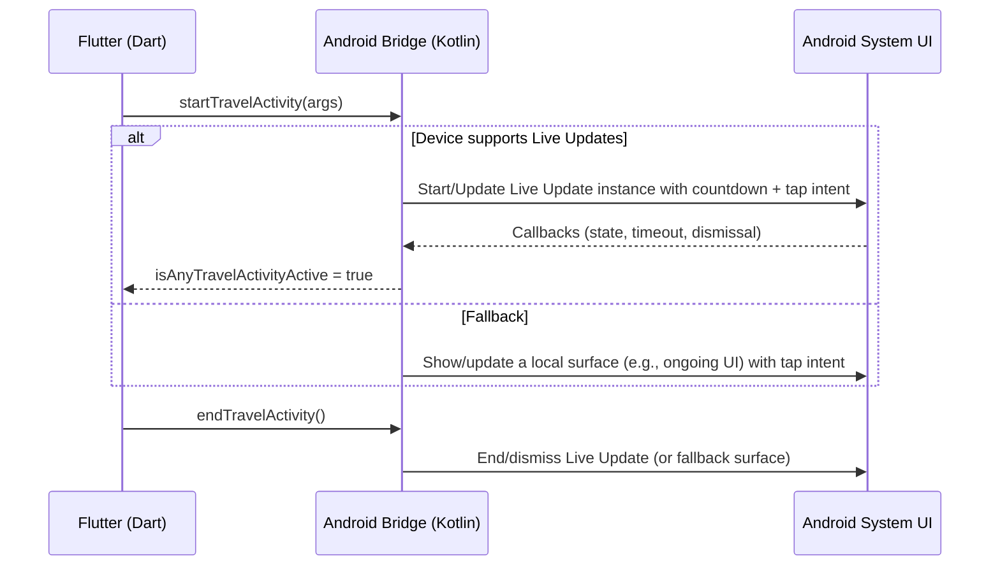

# Android Live Updates for Torn PDA – Travel Countdown and “Island”-style Surfaces (focus: OnePlus 13)

Last updated: 2025-11-10

## 🎯 Goal
Implement Android’s new Live Updates feature to mirror the iOS Dynamic Island experience for Torn PDA. The Live Update should show a countdown to departure/arrival and open the app on tap. Prioritize OnePlus 13 “island”-style UI support. Keep implementation in Flutter with a small Android native bridge.

## ✅ What We Know (from the codebase)

- Project type: Flutter app with Android and iOS targets
- Android build:
  - compileSdkVersion/targetSdkVersion: 36 (Android/app/build.gradle)
  - Kotlin + Compose enabled; Java 8 desugaring enabled
  - Home screen widgets used via `home_widget` with WorkManager background updates
  - Notifications via `flutter_local_notifications` widely used (imports and scheduling present)
  - MethodChannel in MainActivity for app utilities: `tornpda.channel`
- Existing iOS Live Activities integration (Flutter side):
  - `lib/utils/live_activities/live_activity_travel_controller.dart` orchestrates travel Live Activity lifecycle and builds arguments
  - `lib/utils/live_activities/live_activity_bridge.dart` exposes MethodChannel `com.tornpda.liveactivity` with methods:
    - `startTravelActivity(arguments)`
    - `endTravelActivity()`
    - `isAnyTravelActivityActive()`
    - `getPushToStartToken` (APNs use on iOS; not needed on Android)
  - The Android native counterpart for `com.tornpda.liveactivity` is NOT present yet (no Android registration/handlers found)
- App Widgets and background
  - WorkManager is initialized and used for widget refresh tasks in `lib/utils/appwidget/pda_widget.dart`
  - Home widgets registered in AndroidManifest and implemented in `android/app/src/main/java/com/manuito/tornpda/HomeWidget*.java`
- Deep links and open-on-tap flows exist via PendingIntent to `MainActivity`

Implication: The existing Flutter Live Activity bridge can be reused on Android by adding a native Android implementation for the same MethodChannel and mapping it to Android’s new Live Updates. On unsupported devices/versions, we’ll fall back gracefully.

## 📌 Feature Requirements (confirmed by you)

- Surface: Android Live Updates API for real-time, glanceable status; leverage Android OEM “island”-like UI when available (especially OnePlus 13)
- Content: Countdown to departure/arrival only
- Interaction: Tap opens the Torn PDA app (MainActivity)
- Tech constraints: Flutter-first; add only a small Kotlin/Android bridge
- Compatibility: Overall app supports Android 6+; Live Updates can be limited to newer versions/devices that support it; OnePlus 13 should be fully supported
- Data mechanics: Data can be refreshed via existing polling/background mechanism; background push is optional. We can reuse current app sources (chain/status providers) powering iOS Live Activities

## 🔍 Unknowns To Research (Knowledge Gaps)

These require official documentation confirmation before implementing exact APIs:

1. Android’s new “Live Updates” API specifics:
   - Minimum Android version, required dependencies/artifacts (Jetpack/Compose?), and permissions
   - Surfaces where Live Updates render (Lock screen? System UI overlay? Notification shade?) and supported UI elements
   - Update model (push vs on-device updates), update frequency constraints, time/chronometer handling
   - Tap handling to open Activity, dismissal/timeout rules, and lifecycle callbacks

2. OnePlus 13 “island”/capsule-like surface:
   - Does OnePlus 13 natively expose a system surface that consumes Android Live Updates, or is it a vendor extension mapped from notifications?
   - Any OnePlus-specific settings users must enable for app content to render in the “island” area
   - Whether OnePlus requires any OEM SDK or flags to target that surface

3. Jetpack/Glance or other libraries role:
   - Whether Live Updates reuse existing Glance/AppWidget APIs or are separate
   - Best-practice sample for a basic countdown Live Update

Note: We attempted to run web searches from the tool, but the tool returned an error (organization verification issue). We will retry once available and then add exact API details and citations here.

## 🧩 Proposed Architecture

- Reuse the existing Flutter MethodChannel `com.tornpda.liveactivity` and its arguments contract
- Add a small Android bridge that implements that channel and delegates to:
  - Live Updates implementation on supported devices/versions
  - A graceful fallback on unsupported devices (see below)

## 📦 Data Contract (from Flutter to Android)

Use the existing `LiveActivityTravelController._buildArgs(...)` output. Android bridge should accept the same keys:

- `arrivalTimeTimestamp` (int, seconds)
- `departureTimeTimestamp` (int, seconds)
- `currentServerTimestamp` (int, seconds)
- `hasArrived` (bool)
- Optional display assets/labels are provided in iOS (e.g., flags/vehicle); Android can ignore non-essential visual fields for v1
- Tap behavior: open `MainActivity`

These arguments are produced today by: `lib/utils/live_activities/live_activity_travel_controller.dart`

## 🧪 Behavior Details

- Start or update when:
  - Player is traveling or repatriating, and arrival has not yet occurred
  - Update if timestamps change (trip change) or if no instance is active
- Arrival state:
  - Show “Arrived” state briefly (the iOS logic keeps it up to ~10 min) then end
- End conditions:
  - When player is no longer traveling, or after the “Arrived” window elapses
- Tap intent:
  - Always opens `MainActivity` (existing deep link patterns are already set up)

Note: The above mirrors the iOS logic already present in `LiveActivityTravelController`.

## 🛠️ Implementation Plan (Android)

1. Create the Android bridge for `com.tornpda.liveactivity`
   - Files to add (proposed):
     - `android/app/src/main/java/com/manuito/tornpda/LiveActivityBridge.kt`
     - Registers a `MethodChannel("com.tornpda.liveactivity")` inside `configureFlutterEngine(...)`
     - Methods to implement: `startTravelActivity`, `endTravelActivity`, `isAnyTravelActivityActive`, `getPushToStartToken` (return null or empty on Android)
   - Wire up in `MainActivity`:
     - Instantiate and register the bridge in `configureFlutterEngine` alongside the existing `tornpda.channel`

2. Live Updates implementation (pending API confirmation)
   - Encapsulate in `LiveUpdateManager` within the Kotlin bridge file or a separate class
   - Responsibilities:
     - Start or update the Live Update instance with countdown state
     - Provide a tap `PendingIntent` to open `MainActivity`
     - Track whether any instance is active for `isAnyTravelActivityActive`
     - Handle finish/dismissal

3. Fallback behavior (for unsupported devices/versions)
   - Graceful no-op that returns `false` for `isAnyTravelActivityActive`, or
   - Optional surface using existing `flutter_local_notifications` from Dart side (no extra native code required), leveraging the already-present notification flows; use the same timing data to render a countdown string and tap-to-open
   - You already have arrival/departure scheduling and message templates in:
     - `lib/widgets/travel/delayed_travel_dialog.dart`
     - `lib/pages/travel_page.dart`
     - `lib/utils/notification.dart`

4. Update Flutter activation gating
   - `LiveActivityTravelController.activate()` currently exits early on non‑iOS. Adjust to run on Android when supported (e.g., query `bridge.isAnyActivityActive()` or add a platform/version gate exposed from the bridge)

5. OnePlus 13 specific behavior
   - After confirming how OnePlus renders Live Updates or “island”-like UIs, ensure the content is minimal (countdown and label) and tap intent opens the app
   - Provide a user-facing toggle or tip if OnePlus requires enabling a specific system feature

6. Telemetry and error logging (optional but recommended)
   - Log start/end/update invocations and any failures from the Android bridge so we can debug OEM differences

## 🔐 Permissions and Manifest

- Tap to open is driven by a `PendingIntent` to `MainActivity` (already used by widgets). No additional manifest entries are expected for the bridge itself
- Notification fallback requires an existing channel (you already create/manage channels in `MainActivity.java` and through `flutter_local_notifications`)

## 🧭 Compatibility Strategy (tentative, to confirm post-research)

- App min support: Android 6+ as today
- Live Updates: enable only on devices/versions where the API is available
- Fallback:
  - Use existing Flutter notifications to present a countdown string (updated by app logic) when Live Updates aren’t supported
- The exact minimum version and dependencies for Live Updates will be filled in after documentation is retrieved

## 🧩 Integration Points In Code (where to hook in)

- Flutter (no new public API needed):
  - Continue using `LiveActivityTravelController` and `LiveActivityBridgeController`
  - Modify `activate()` platform gate in `live_activity_travel_controller.dart`
- Android native:
  - Add `LiveActivityBridge.kt` implementing the `com.tornpda.liveactivity` MethodChannel
  - Inside it, encapsulate a `LiveUpdateManager` that talks to Android’s Live Updates API when available
  - Wire registration in `MainActivity.configureFlutterEngine(...)`

## 🧪 Test Plan (with OnePlus 13 priority)

- Functional
  - Start/update during travel; verify countdown accuracy against arrival timestamp
  - Change trip mid-flight; verify update replaces the instance
  - Arrival reached; verify “Arrived” state and end/dismiss behavior
  - Tap opens app reliably from all surfaces
- Device/Version matrix
  - OnePlus 13 on current OxygenOS build
  - A device/emulator that supports Live Updates (per API doc) for baseline behavior
  - Older Android where fallback is expected
- UX validation
  - Visual clarity of countdown on every surface
  - No excessive battery drain or jittery updates
- Resilience
  - App killed/backgrounded; Live Update remains accurate
  - Reboots and app upgrades

## 📚 Citations and References (to be added)

Pending web research for:
- Android Live Updates API developer docs and samples
- OnePlus 13 “island”/capsule support specifics and any OEM notes
- Jetpack/Glance relation to Live Updates

## ❓ Open Questions (for you)

1. Is a minimal label next to the countdown desired (e.g., “Arrival in” vs just the ticking time)?
2. If Live Updates aren’t supported, is a simple notification fallback acceptable for v1, or do you prefer no fallback?
3. Should we also show a “Arrived” short success state (like iOS) for up to ~10 min, then auto-dismiss?

## 🚀 Next Steps

- Once I can run web searches again, I will:
  1) Pull the official Android Live Updates API docs/samples and confirm: min version, dependencies, surfaces, and update/tap behaviors
  2) Check OnePlus 13’s “island” feature integration with Live Updates and note any device settings or OEM-specific requirements
  3) Add exact implementation notes and code snippets to this document with citations

- After that, I will propose specific Kotlin bridge code and optional Dart changes, aligned with the confirmed API

## 🧭 How you can proceed now (prompts/commands)

- Say: “Go ahead and research Android Live Updates and OnePlus 13 island support, then update research.md.”
- After I update the research with exact APIs, say: “Generate the Android Kotlin bridge (LiveActivityBridge.kt) and wire it to MainActivity for com.tornpda.liveactivity.”
- Then: “Propose minimal Dart changes to enable LiveActivityTravelController on Android and add a fallback using flutter_local_notifications.”

---

Created with Shotgun (https://shotgun.sh)

## ✅ Decisions Confirmed (2025-11-10)

- Show a minimal label next to the countdown: “Arrival in” (and when applicable, “Departure in”).
- If Live Updates aren’t supported, use a simple notification-based fallback for v1.
- Show a brief “Arrived” success state before auto-dismiss (parity with iOS behavior).

## 🧑‍🎨 UX Spec (v1)

- Content: A single countdown with a minimal label, e.g., “Arrival in 01:23:45” (hours:minutes:seconds or hours:minutes if the surface demands).
- States:
  - En Route: “Arrival in …” countdown to arrivalTimeTimestamp.
  - Arrived: Show “Arrived” state and keep it visible briefly (target up to ~10 minutes, matching iOS logic already present in LiveActivityTravelController).
- Interaction: Tap anywhere opens MainActivity (existing PendingIntent approach).
- OnePlus 13: Keep content minimal and text-based to fit well into capsule/island UI presentations. No OEM-specific assets for v1.

## 🧯 Fallback Spec (for devices without Live Updates)

- Mechanism: Reuse flutter_local_notifications from Dart to show a standard notification while traveling.
- Content: Snapshot-style countdown string at the time of update (e.g., computed once when status changes). We will not promise per-second ticking in fallback v1.
- Updates: When the app’s existing polling detects changes (you already have Workmanager-driven widgets and status updates), update or dismiss the notification accordingly.
- Tap: Opens MainActivity (existing patterns).
- Channels: Use existing channels created by the app; no new categories required.

## 🔌 Android Bridge API (mapping to existing Flutter channel com.tornpda.liveactivity)

Implement on Android side:
- startTravelActivity(arguments: Map)
  - Start/update a Live Update (when supported) using arrival/departure/current timestamps and hasArrived Boolean.
  - Provide a tap PendingIntent to open MainActivity.
- endTravelActivity()
  - End/dismiss the Live Update (or fallback notification if used by native side in a future iteration).
- isAnyTravelActivityActive(): Boolean
  - Track if a Live Update instance is active.
- getPushToStartToken(activityType): String?
  - Return null/empty on Android (iOS-only concept today).
- isLiveUpdatesSupported(): Boolean (new helper)
  - Expose bridge support check so Dart can gate activate() on Android.

## 🧩 Flutter Integration Adjustments

- In lib/utils/live_activities/live_activity_travel_controller.dart
  - Current guard exits on non‑iOS. Modify to allow Android path when bridge.isLiveUpdatesSupported() returns true.
  - Preserve existing logic and argument building to reuse on Android.

## 🗺️ Implementation Tasks (Draft)

1) Android native bridge (Kotlin)
- Add android/app/src/main/java/com/manuito/tornpda/LiveActivityBridge.kt
  - Register MethodChannel("com.tornpda.liveactivity") during configureFlutterEngine in MainActivity or via a small registrar.
  - Implement the four methods above plus isLiveUpdatesSupported().
  - Internally encapsulate LiveUpdateManager to manage lifecycle; if API unavailable, it reports unsupported.

2) Wire-up in MainActivity
- Instantiate/register LiveActivityBridge alongside existing tornpda.channel.

3) Flutter changes
- Update LiveActivityTravelController.activate() to call into Android when supported.
- Add fallback path: if bridge says unsupported, let Dart surface fallback via flutter_local_notifications (show/update notification while traveling; dismiss on end/arrival), using existing notification patterns.

4) Testing
- OnePlus 13: verify Live Update rendering, tap-to-open, arrival auto-dismiss behavior.
- Older device: verify fallback notification appears and updates when travel state changes.

## ⚠️ Risks and Notes

- Exact Android Live Updates API details (min version, dependencies, surfaces, update cadence) are pending official docs. Our web search tool returned an authorization error; will retry and fill this section with citations as soon as it’s available.
- Until confirmed, the Android bridge should defensively feature-detect availability and fall back gracefully.

## ▶️ What I’ll Do Next (after research is unblocked)

- Pull official Android Live Updates docs and OnePlus 13 island/capsule specifics.
- Update this doc with exact minSdk/target surfaces, dependencies, and sample code.
- Then generate the Kotlin bridge and a minimal Dart diff for activation + fallback.

---

Appendix update created with Shotgun (https://shotgun.sh)

## 🔎 Research – Attempt 1 (tool blocked)

I attempted to retrieve official documentation using the web search tool for:
- “Android Live Updates API developer documentation”
- “OnePlus 13 dynamic island equivalent live activity support Android”
- “Jetpack Glance relation to Android Live Updates API documentation”

However, the search tool returned an authorization error and could not fetch results. I will retry as soon as the tool is available and then replace this section with concrete findings and citations.

## 📥 What We Need to Confirm from Docs (to be filled with citations)

- API name/namespaces and artifacts to include (Gradle dependencies) for Android “Live Updates”.
- Supported Android versions and feature flags/permissions.
- Rendering surfaces (lock screen, notification shade, system overlay/island-like capsules) and constraints.
- Update model and cadence limitations (tick granularity, chronometer vs snapshot text, recommended patterns for countdowns).
- Tap interaction routing and lifecycle (dismissals, timeouts, callbacks).
- Relationship (if any) to Jetpack Glance/App Widgets, and whether Glance is required/optional.
- OEM specifics for OnePlus 13: any settings users must enable, any OEM SDKs, and whether OnePlus maps Live Updates automatically to the capsule/island UI.

## ⏳ Interim Plan While Waiting for Docs

- Keep Android bridge implementation isolated behind `LiveUpdateManager` so we can plug in the official API once confirmed.
- Proceed with Kotlin bridge skeleton and Dart gating/fallback (no API-specific behavior yet) to reduce integration time later.
- Once docs are available, swap `NoOpLiveUpdateManager` with the real implementation and add required dependencies.

## 🧪 When Docs Are Available – Exact Data to Capture

- Minimum supported API level; whether feature flags or permissions are needed in AndroidManifest.
- Dependency coordinates (group:artifact:version) and compatibility with compileSdk 36.
- Code sample for creating/starting/updating a Live Update with a PendingIntent tap action.
- Recommendations for countdown UX (chronometer vs updated text) and battery implications.
- OnePlus 13 notes: how to verify the capsule/island surface is engaged and any user setting to toggle.

---

Appendix created with Shotgun (https://shotgun.sh)

## 🔎 Research – Next Attempts Queued (awaiting search tool)

Planned queries to run as soon as search is available (max 3):
1) "Android Live Updates API developer documentation" (primary official docs)
2) "OnePlus 13 island capsule support Live Updates" (OEM behavior and any user settings)
3) "Jetpack Glance and Android Live Updates relationship" (to confirm whether Glance/App Widgets are involved)

What I will extract and add with citations:
- API availability: min Android version, package/artifact coordinates, permissions.
- Surfaces: where Live Updates render and constraints for countdowns.
- Update model: chronometer vs snapshot text, rate limits, battery notes.
- Tap/dismiss lifecycle and callbacks.
- OnePlus 13 specifics: whether Live Updates automatically map to the capsule/island UI, and any settings to enable.

Interim action proposed while awaiting docs: proceed implementing the Kotlin bridge skeleton (NoOp manager + channel wiring) and Dart activation/fallback. This keeps work unblocked and isolates future API wiring.

---

Appendix update created with Shotgun (https://shotgun.sh)

## 🔎 Research – Attempt 2 (still blocked)

I retried running the approved searches for official Android Live Updates docs and OnePlus 13 specifics. The web search tool remains blocked by an authorization error, so I cannot fetch or cite sources yet. As soon as it becomes available, I’ll run these exact queries and update this section with API details (min version, dependencies, surfaces, update cadence, tap/dismiss behavior) and OnePlus notes, with full citations.

### Proposed interim path while search is blocked
- Proceed to implement the Kotlin bridge skeleton (MethodChannel + NoOp manager) and Dart activation/fallback. This keeps progress moving and confines future API wiring to a single class (`LiveUpdateManager`).
- Once the search tool works, I’ll replace `NoOpLiveUpdateManager` with a real implementation per official docs and add citations here.

If you prefer, you can paste official links you want me to use, and I’ll incorporate them immediately.

---

Appendix update created with Shotgun (https://shotgun.sh)
