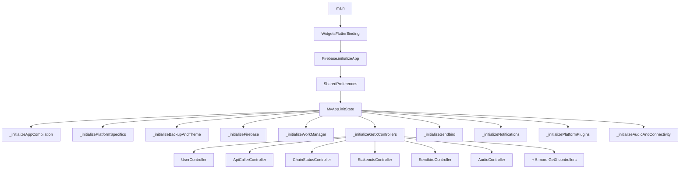
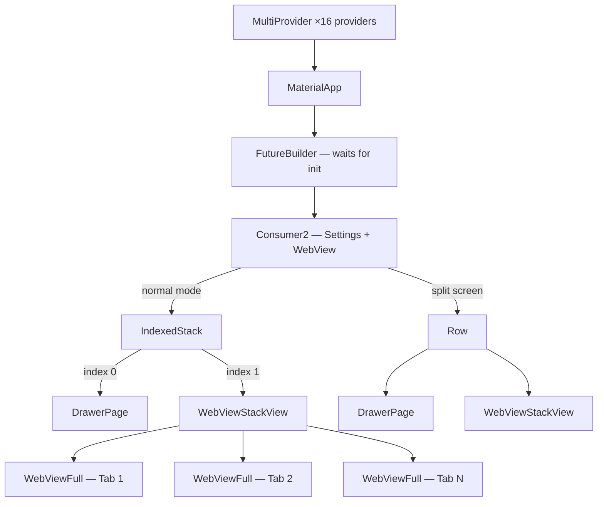
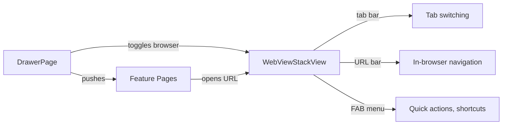
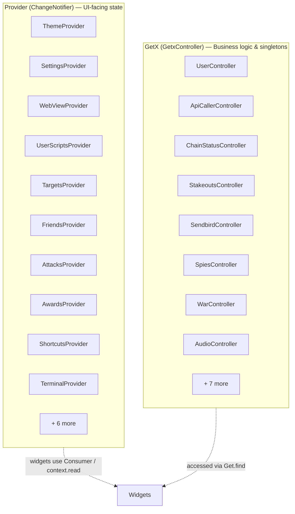
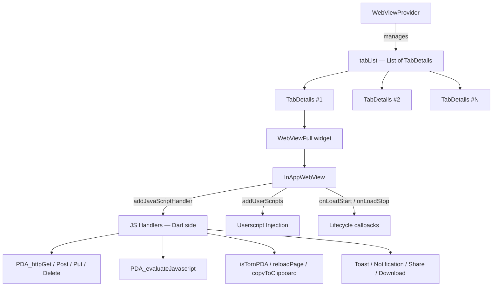
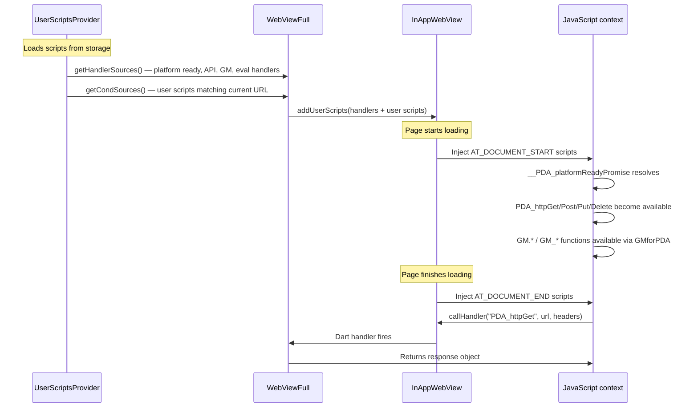
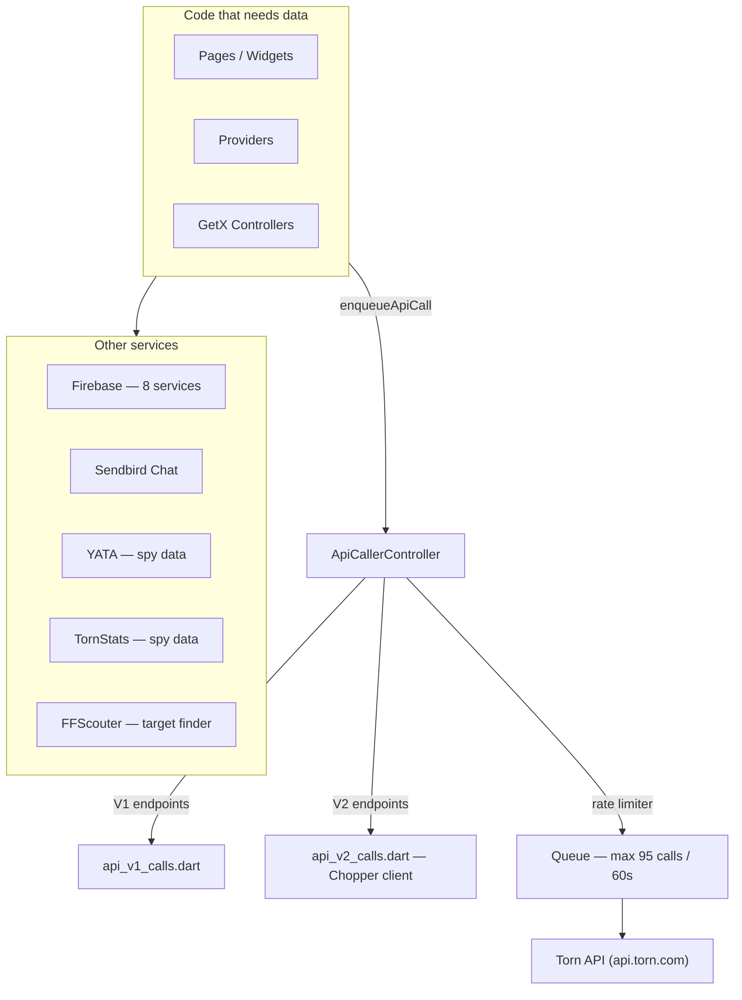
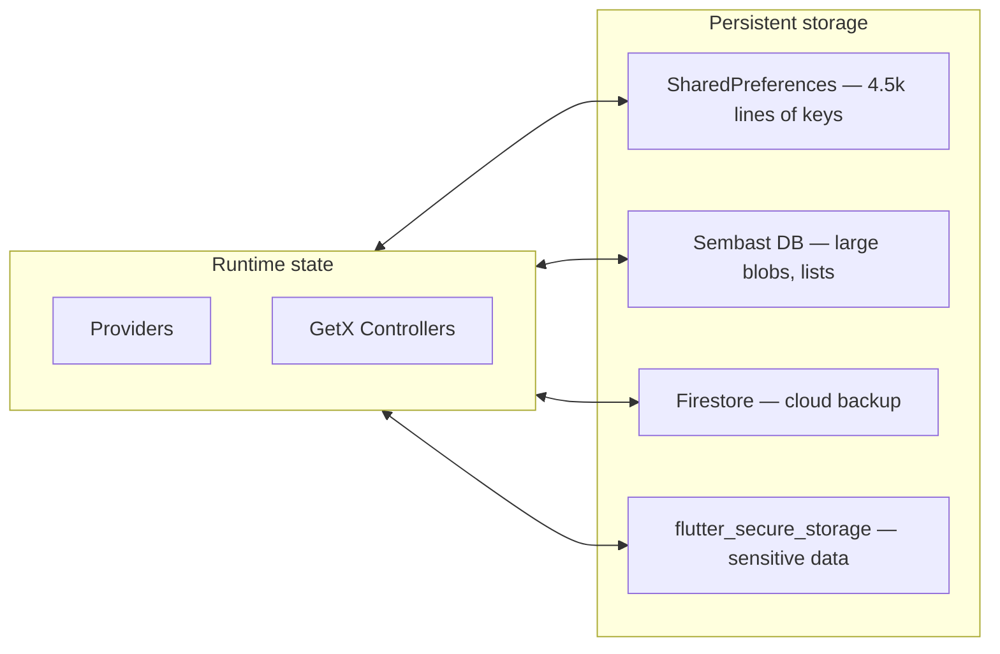
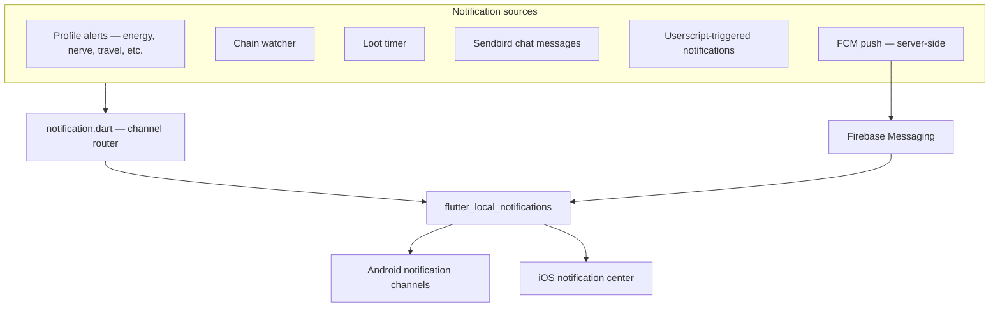

# Torn PDA - Architecture Overview

A high-level map of how the app is wired together, aimed at contributors who want to understand the codebase before diving in.

---

## Table of Contents

- [Project Layout](#project-layout)
- [App Startup](#app-startup)
- [Widget Tree](#widget-tree)
- [Navigation](#navigation)
- [State Management](#state-management)
- [WebView System](#webview-system)
- [Userscript Pipeline](#userscript-pipeline)
- [API Layer](#api-layer)
- [Data Persistence](#data-persistence)
- [Notification System](#notification-system)
- [Key Dependencies](#key-dependencies)

---

## Project Layout

```
lib/
 ├── main.dart                   # Entry point, provider registration, Firebase init
 ├── drawer.dart                 # Drawer-based navigation (3.4k lines)
 ├── config/                     # Private config stubs (API keys, feature flags)
 ├── models/                     # Data classes, API models, Swagger-generated code
 │   └── api_v2/                 # Chopper + Swagger generated Torn API V2 models
 ├── pages/                      # Feature screens (profile, chaining, travel, etc.)
 ├── providers/                  # State management — Provider + GetX controllers
 │   └── api/                    # API caller, V1 & V2 endpoint definitions
 ├── utils/                      # Helpers: JS snippets, notifications, storage
 │   ├── js_snippets/            # Injected JavaScript (HTTP handlers, GM bridge, quick items)
 │   ├── webview/                # WebView handlers (Dart ↔ JS bridge)
 │   └── live_activities/        # iOS Live Activities bridge
 ├── widgets/                    # Reusable components
 │   └── webviews/               # Core browser: tabs, FAB, dialogs, dev tools
 └── torn-pda-native/            # Native auth & stats modules (stubs in public repo)

userscripts/                     # Bundled JS: TornPDA_API, GMforPDA, example scripts
cloud_functions/                  # Firebase Cloud Functions (Node.js)
docs/                            # Developer documentation (you are here)
```

---

## App Startup

`main.dart` orchestrates a sequential initialization before handing off to the widget tree.



All `ChangeNotifierProvider`s are registered in the `MultiProvider` wrapping `MyApp`. GetX controllers are registered via `Get.put()` during init.

---

## Widget Tree



`IndexedStack` keeps both the drawer and browser alive in memory. `WebViewStackView` renders all tabs and uses visibility flags to show only the active one.

---

## Navigation



| Mechanism | Where | Notes |
|-----------|-------|-------|
| Drawer menu | `drawer.dart` | `Navigator.push` to feature pages |
| Browser toggle | `WebViewProvider.browserShowInForeground` | Swaps IndexedStack index |
| Tab management | `WebViewProvider.tabList` | Add / remove / activate / sleep tabs |
| Split screen | `WebViewProvider.webViewSplitActive` | Side-by-side drawer + browser on wide displays |

---

## State Management

Two patterns coexist, roughly split by purpose:



**Provider** powers anything that drives widget rebuilds (theme, settings, webview tab state, userscripts).
**GetX** manages long-lived services that don't need per-widget rebuild semantics (API rate limiter, chain watcher, chat, audio).

---

## WebView System

The browser is the heart of the app. Every tab is its own `WebViewFull` widget backed by `flutter_inappwebview`.



### TabDetails

Each tab carries:

| Field | Purpose |
|-------|---------|
| `id` | Unique identifier |
| `webView` / `sleepingWebView` | Widget or sleeping placeholder |
| `currentUrl` / `pageTitle` | Current state |
| `historyBack` / `historyForward` | Navigation stacks |
| `isLocked` / `isLockFull` | Tab locking (prevent accidental navigation) |
| `isChainingBrowser` | Special chaining mode |
| `chatRemovalActiveTab` | Chat widget removal toggle |

---

## Userscript Pipeline



### @match Pattern Matching

When a page loads, `UserScriptsProvider` calls `shouldInject(url)` on each script. The matching follows the [Tampermonkey @match standard](https://www.tampermonkey.net/documentation.php?locale=en#meta:match):

- `*` alone matches everything
- `*://` matches http and https
- `*.example.com` matches the domain with or without a subdomain
- `*` in the path matches any characters
- Legacy patterns without a protocol are auto-prefixed with `*://`

---

## API Layer



| Service | Purpose | Package |
|---------|---------|---------|
| **Torn API V1** | Legacy game data endpoints | `http` |
| **Torn API V2** | Modern Swagger-based API | `chopper` + generated models |
| **Firebase Auth** | Anonymous auth | `firebase_auth` |
| **Firestore** | Settings backup, messaging tokens | `cloud_firestore` |
| **FCM** | Push notifications | `firebase_messaging` |
| **Crashlytics** | Error tracking | `firebase_crashlytics` |
| **Sendbird** | In-game chat | `sendbird_chat_sdk` |
| **YATA / TornStats** | Spy data, stats | `http` / `dio` |

---

## Data Persistence



| Store | What lives there | Access |
|-------|-----------------|--------|
| **SharedPreferences** | Settings, alert configs, targets, sort prefs, theme, tab state — almost everything | `Prefs()` singleton (`shared_prefs.dart`, ~4.5k lines) |
| **Sembast** | Large data that doesn't fit well in SharedPreferences | `SembastDb` class (`sembast_db.dart`) |
| **Firestore** | Cloud backup of user settings, alert configs, messaging tokens | `FirebaseFirestoreUtils` |
| **Secure Storage** | API keys, sensitive credentials | `flutter_secure_storage` / `encrypt_shared_preferences` |

---

## Notification System



Notification IDs are namespaced by feature:
- `101–110` — Profile cooldowns
- `201` — Travel arrival
- `555` — Chain watcher
- `666+timestamp` — Sendbird chat
- `88001+` — WebView / userscript notifications

Each Android notification channel has its own color, sound, and importance level.

---

## Key Dependencies

| Category | Package | Purpose |
|----------|---------|---------|
| **WebView** | `flutter_inappwebview` | In-app browser with JS bridge |
| **State** | `provider`, `get` | UI state + business logic |
| **Firebase** | 8 packages | Auth, DB, messaging, analytics, crashlytics |
| **Chat** | `sendbird_chat_sdk` | In-game chat |
| **HTTP** | `http`, `dio`, `chopper` | API calls + code generation |
| **Storage** | `shared_preferences`, `sembast`, `flutter_secure_storage` | Local persistence |
| **Notifications** | `flutter_local_notifications`, `firebase_messaging` | Push + local alerts |
| **Background** | `workmanager` | Background task scheduling |
| **UI** | `expandable`, `fl_chart`, `flutter_slidable`, `showcaseview` | Specialized widgets |
| **Platform** | `device_info_plus`, `connectivity_plus`, `wakelock_plus` | Device capabilities |
| **Live Activities** | Custom bridge | iOS 16.2+ live activities for travel, racing |

---

## Further Reading

- [JavaScript ↔ WebView Handlers](./webview/webview-handlers.md) — full handler reference
- [HTTP Handlers](./webview/http-handlers.md) — GET, POST, PUT, DELETE from JS
- [Notification Handlers](./webview/notification-handlers.md) — triggering notifications from userscripts
- [Building from Source](./README.md) — config stubs, signing, build commands
